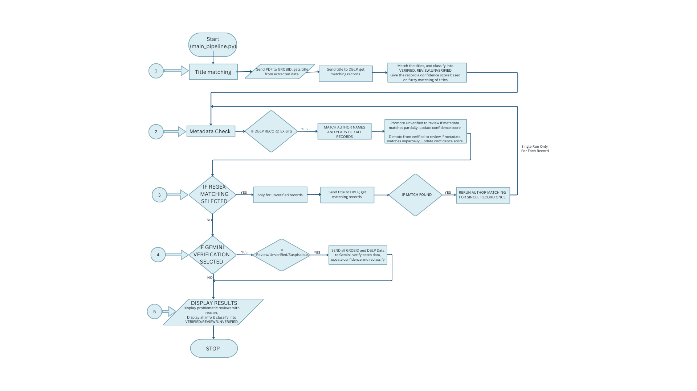

# Reference Hallucination Checker

A multi-step verification pipeline that extracts bibliographic references from research papers (PDFs) using GROBID and verifies their existence using the DBLP API to detect "hallucinated" or incorrect citations.

## 🚀 Quick Start

### Prerequisites

1. **GROBID** must be running locally on port 8070:

   ```bash
   docker pull grobid/grobid:0.8.2-full
   docker run --rm --init -p 8070:8070 grobid/grobid:0.8.2-full
   ```

2. Verify GROBID is running:

   ```bash
   curl http://localhost:8070/api/isalive
   ```

3. **(Optional)** Set up Gemini API key for advanced verification:
   ```bash
   export GEMINI_API_KEY="your-api-key"
   ```

### Run the Tool

```bash
python3 main_pipeline.py <path_to_pdf>
```

Example:

```bash
python3 main_pipeline.py data/raw/paper.pdf
```

## 📂 Project Structure

```text
Reference_Halucinations/
├── data/
│   ├── raw/                    # Input PDFs
│   └── output/                 # JSON output files
├── extraction/                 # Reference extraction modules
│   ├── extractRefData.py       # Sends PDF to GROBID, returns XML
│   ├── extractMetadata.py      # Parses XML to extract full metadata
│   ├── extractTitle.py         # Parses XML to extract paper titles
│   ├── pdfplumber_extract.py   # Fallback PDF text extraction
│   └── parser.py               # Reference parsing utilities
├── verification/               # Verification modules
│   ├── dblp.py                 # DBLP API queries & classification
│   ├── gemini.py               # Gemini API for advanced verification
│   ├── utils.py                # Title cleaning & author matching
│   ├── checker.py              # Legacy orchestrator
│   └── verifier.py             # Verification helpers
├── fluff/                      # Verification reports output
├── tests/                      # Test suite
│   ├── unit/
│   └── integration/
├── main_pipeline.py            # Multi-step verification pipeline
├── main.py                     # Simple entry point (legacy)
└── requirements.txt            # Project dependencies
```

## 🔄 Verification Pipeline

The verification process follows a multi-stage pipeline designed to minimize false positives while detecting hallucinations. The logic flows from strict API matching to fuzzy metadata comparisons, and finally to AI-based verification if needed.



### Step 1: Title Matching

- Extracts references from PDF via GROBID
- Queries DBLP API with normalized titles
- Applies length penalty for short/generic titles
- Classifies as: VERIFIED, REVIEW, UNVERIFIED, or SUSPICIOUS

### Step 2: Metadata Check (Author & Year)

- For references with DBLP candidates, compares author lists
- Uses last-name matching with fuzzy comparison
- Boosts confidence for matching authors/years
- Re-queries DBLP for UNVERIFIED refs (handles transient failures)

### Step 3: Regex Re-extraction (Conditional)

- Activated if DBLP match is not found (`UNVERIFIED`)
- Extracts raw text from PDF using pdfplumber
- Applies regex patterns to find reference titles
- Re-verifies against DBLP with corrected titles

### Step 4: Gemini Verification (Conditional)

- Processed if enabled and references remain `REVIEW` or `UNVERIFIED`
- Batch processing to avoid rate limiting
- Returns verification status based on AI analysis

### Step 5: Display Results

- Generates comprehensive report with statistics
- Sorts references by verification status
- Outputs to `fluff/verification_report_<timestamp>.txt`

## 📊 Classification Labels

| Label        | Description                                                    |
| ------------ | -------------------------------------------------------------- |
| `VERIFIED`   | Title found in DBLP with high confidence (≥0.7)                |
| `REVIEW`     | Ambiguous match - multiple candidates with similar scores      |
| `UNVERIFIED` | Title not found in DBLP (may be non-CS venue, book, or report) |
| `SUSPICIOUS` | Low confidence match - metadata doesn't align well             |

## 🛠 Installation

1. Create a virtual environment:

   ```bash
   python3 -m venv .venv
   source .venv/bin/activate
   ```

2. Install dependencies:

   ```bash
   pip install -r requirements.txt
   ```

## 📦 Dependencies

- `requests` - HTTP client for GROBID and DBLP APIs
- `beautifulsoup4` - XML parsing for GROBID output
- `lxml` - XML parser backend
- `pdfplumber` - PDF text extraction for fallback
- `google-generativeai` - Gemini API client (optional)

## ⚙️ Configuration

Key thresholds in `verification/dblp.py`:

| Parameter              | Value | Description                               |
| ---------------------- | ----- | ----------------------------------------- |
| `SIMILARITY_THRESHOLD` | 0.7   | Minimum score to consider a match         |
| `AMBIGUITY_GAP`        | 0.05  | Gap between top matches to flag ambiguity |

### GROBID Title Error Fixes

The tool automatically fixes common GROBID extraction errors:

- `schemabased` → `schema-based`
- `prompttuning` → `prompt-tuning`
- `lowresource` → `low-resource`
- And many more compound word fixes

## 🐳 GROBID Setup

Pull and run GROBID with Docker:

```bash
# Pull the full image (includes all models)
docker pull grobid/grobid:0.8.2-full

# Run GROBID server
docker run --rm --init -p 8070:8070 grobid/grobid:0.8.2-full

# Verify it's running
curl http://localhost:8070/api/isalive
```

GROBID will be available at `http://localhost:8070`.

## 📈 Typical Results

On academic CS papers, the tool typically achieves:

- **70-90% VERIFIED** - References found in DBLP
- **0-5% REVIEW** - Need manual verification
- **10-25% UNVERIFIED** - Not in DBLP (statistics journals, books, tech reports)
- **0-2% SUSPICIOUS** - Low confidence matches

### Common UNVERIFIED Categories (Not Hallucinations)

- Statistics journals (JASA, Annals of Statistics)
- GIS/Photogrammetry venues (ISPRS)
- Pre-1970 classic papers
- Books and book chapters
- Technical reports
- Dataset citations (e.g., Kaggle)

## 🚀 Usage

# Full pipeline

python3 main_pipeline.py paper.pdf

# Skip Gemini steps (if API quota exceeded)

python3 main_pipeline.py paper.pdf --skip-gemini

# Skip regex re-extraction

python3 main_pipeline.py paper.pdf --skip-regex
